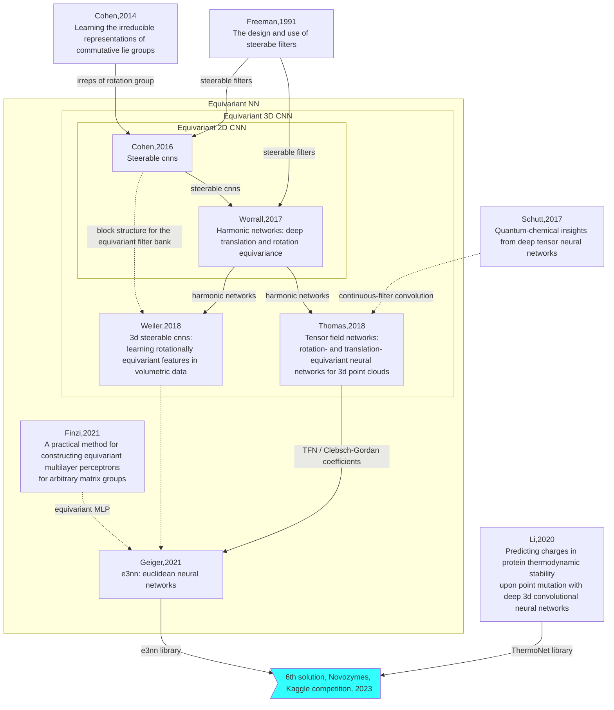

[e3nn](https://www.connectedpapers.com/main/c7215ab4589ce3590910c597e86b1aba8e460d49/e3nn%3A-Euclidean-Neural-Networks/graph)

```mermaid
flowchart TD;
    A[Freeman,1991\nThe design and use of steerabe filters]-- steerable filters -->B[Worrall,2017\nHarmonic networks: deep translation and rotation equivariance]
    A-- steerable filters -->C[Cohen,2016\nSteerable cnns]
    subgraph ide0[Equivariant NN]
    subgraph ide1[Equivariant 3D CNN]
        subgraph ide2[Equivariant 2D CNN]
        C-- steerable cnns -->B
        end
        B-- harmonic networks -->D[Thomas,2018\nTensor field networks:\nrotation- and translation- equivariant neural networks for 3d point clouds]
        B-- harmonic networks -->G[Weiler,2018\n3d steerable cnns:\nlearning rotationally equivariant features in volumetric data]
        C -. block structure for the equivariant filter bank .-> G
    end
        D-- TFN / Clebsch-Gordan coefficients -->F[Geiger,2021\ne3nn: euclidean neural networks]
        G-..->F
        K[Finzi,2021\nA practical method for constructing equivariant multilayer perceptrons\nfor arbitrary matrix groups]-. equivariant MLP .-> F
    end
    E[Schutt,2017\nQuantum-chemical insights from deep tensor neural networks]-. continuous-filter convolution .->D
    H[Li,2020\nPredicting charges in protein thermodynamic stability\nupon point mutation with deep 3d convolutional neural networks]-- ThermoNet library -->I>6th solution, Novozymes, Kaggle competition, 2023]:::kagglecolor
    classDef kagglecolor fill:#33FFFF
    F-- e3nn library -->I
    J[Cohen,2014\nLearning the irreducible representations of commutative lie groups]-- irreps of rotation group --> C
```