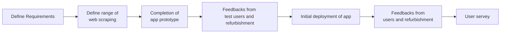
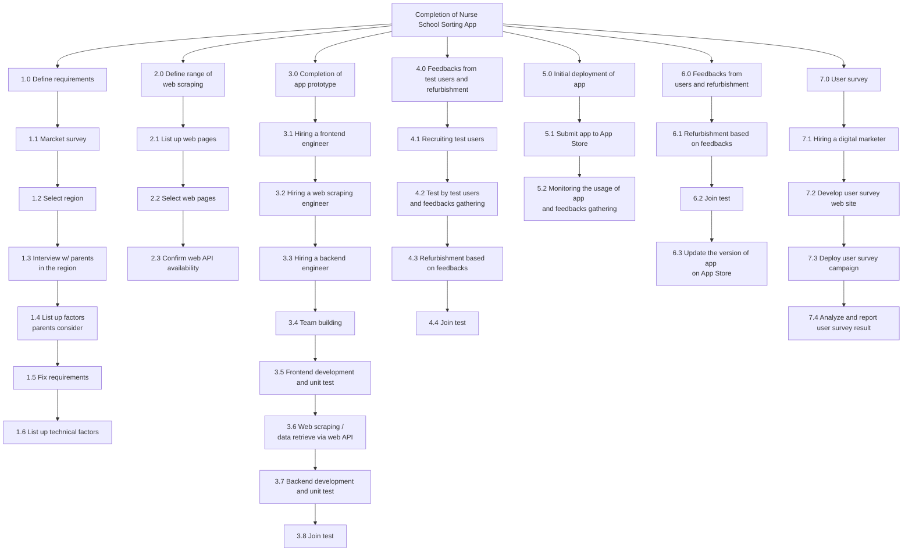
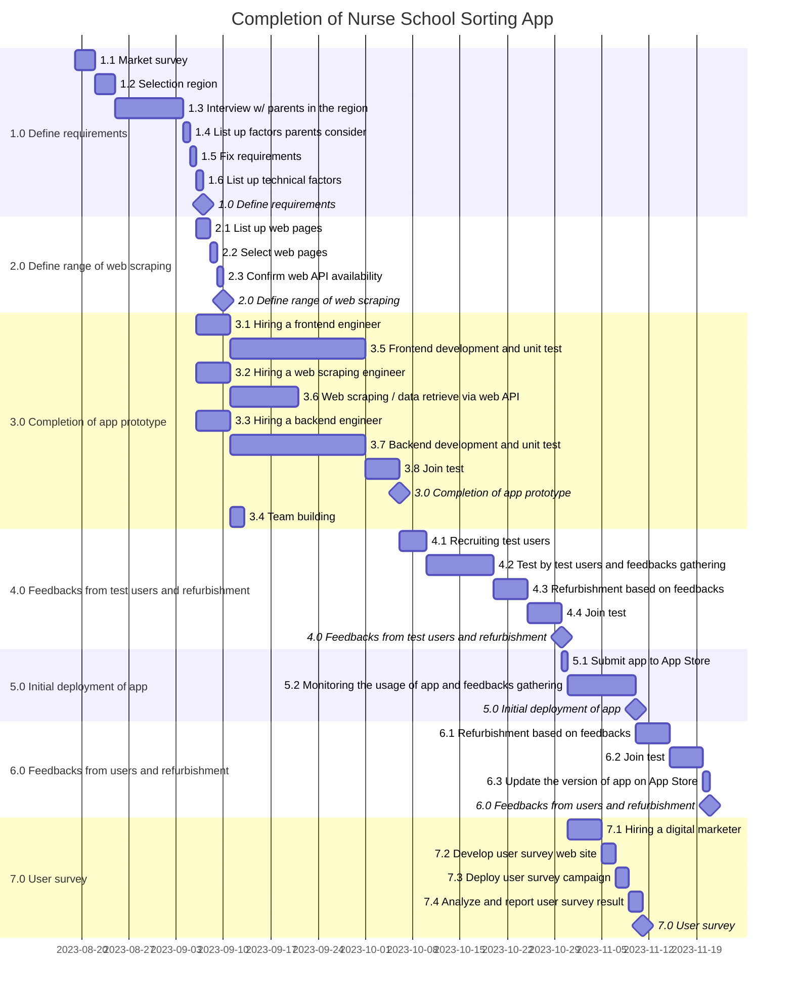

# 1 Narrative Charter Statement
https://www.coursera.org/learn/project-management-capstone/supplement/7vheD/1-narrative-charter-statement

## Project: Development of an App for Automatic Sorting of Nursery Schools by Preference
| Project Owner | Effective Date | Version | Date |
| ---- | ---- | ---- | ---- |
| Ryosuke Horiuchi | August 19, 2023 | First issue | August 11, 2023 |

## a. Project purpose or justification
The purpose of this project is to develop an app that sorts nursery schools by user's preference. In Japan, when parents want their child to go to a nursery school, they have to report their own prefered nursery schools ranking within the region. Nursery schools on this report must be sorted by parents' preference. A municipal office accepts their submit and decide which nursey school can actually acept their child. One of the main factors for this decision is based on the degree of preference, which means more prefered nursery school is more likely to be adopted as their nursey school. This ranking system annoys parents a lot.
<br><br>
Actually, parents sort nursery schools by their preference mannually. There are a lot of factors to be considered: nursery school reputation/popularity, nursery school capacity, geographical conditions, parents' commuting direction, etc. They have to tweek their own weights and biases and culculate a score for every nursery school in their heads. It is really a time-consuming and labor intensive task.
<br><br>
Upon completion of this project, parents will be freed from manual sorting getting a recommended sort result which is customized for them by reflecting their weights and biases from the app.


## b. Measurable project objectives and related success criteria

| Objective | Success Criteria |
| ---- | ---- |
| Eliminattion of manual sorting process for parents. | Over 90% of manual process of each parent must be eliminated by app.|
| Reduce time consumed for manual research on nursery schools. | Over 90% of information gathered by manual research on the internet must be obtained from app. |
| Syncronization of updates on nursery school information | Syncronization between app and a nursery school information website that a municipality runs must be guaranteed. Longer than 15 minutes delay from the last update of municipality website is not accepted. |

## c. High-level requirements
- Completion of the work within the budget approved.
- Completion of the work according to the planning detailed in next sections of this document.
- App must be available in iOS.
- App must be designed to be used in every municipality in Japan. However, in this project the usage of app is limited in a specific area.
- Must comply with personal information protection regulations in Japan
## d. Assumptions and constraints
[Assumptions]
- App to be developed for iOS version 17.
- App to be developed by Swift version 5.8.1 and Xcode version 14.3.1.
- All app data will be stored in Azure cloud server located in Japan east.

[Constrains]
- App just displays a recommended nursery school ranking for a user and does not have any responsibilities or guarantees for receiving approval.

## e. High-level risks
- Chage in application requirements. (Online application, sort ranking not required any more)
- Inadequate knowledge/skills to develop app.
- Running cost of app.
- Lack of added values.
- High variance between municipalities in terms of collectable information from the internet.
- Legality and/or difficulty of web scraping.

## f. Summary milestone schedule

## g. Summary budget
[!image](spreadsheetA')

***
# 2 Work Breakdown Structure
https://www.coursera.org/learn/project-management-capstone/supplement/RGRp2/2-work-breakdown-structure



***
# 3 Sequence Project Activities
https://www.coursera.org/learn/project-management-capstone/supplement/SbODQ/3-sequence-project-activities


***
# 4 Build a Project Schedule
https://www.coursera.org/learn/project-management-capstone/supplement/Dycq0/4-build-a-project-schedule





***
# 5 Create a Project Budget
https://www.coursera.org/learn/project-management-capstone/supplement/xu0Pj/5-create-a-project-budget


***
# 6 Create a RAM
https://www.coursera.org/learn/project-management-capstone/supplement/IO2AX/6-create-a-ram


**R** (Responsible): Person who is completing the task<br>
**A** (Accountable): Person who is making decisions and taking actions on the task(s)<br>
**C** (Consulted): Person who will be communicated with regarding the decision-making process and specific tasks<br>
**I** (Informed): Person who will be updated on decisions and actions during the project

***
# 7 Identify Project Risks
https://www.coursera.org/learn/project-management-capstone/supplement/rKo79/7-identify-project-risks


***
# Appendix
## Tools
- README.md:
    - 1 Narrative Charter Statement
- Mermaid: 
    - 1 > f. Summary milestone schedule
    - 2 Work Breakdown Structure
- Spreadsheet
    - A: 3 - 6
    - A': 1 > g. Summary budget
    - B: 7


## Minimum requirements
```python
minscores1 = {"a":1,"b":1,"c":1,"d":1,"e":1,"f":1,"g":1}
minscores2 = {2:4, 3:3, 4:3, 5:3, 6:1, 7:3}
total = sum(minscores1.values()) + sum(minscores2.values())
print(total)
# 24
```
> The entire project is worth 48 points. A passing score is 34 points and above.

https://www.coursera.org/learn/project-management-capstone/supplement/RtyTu/grading-logistics


## Links to Relevant Course Content
https://www.coursera.org/learn/project-management-capstone/supplement/epvxT/links-to-relevant-course-content


## Example
https://www.coursera.org/learn/project-management-capstone/peer/8TpaT/feedback-peer-review/review/bJ86fHZIEeyglw7n74i5Tw


## FAQ
### What type of files does the Peer Review submission and evaluation take?
During the peer review submission and evaluation phases, learners  will be able to upload (in the submission phase) and download  (in the evaluation phase)  .txt, .csv, .html, .htm, .css, .pdf, .jpeg,  .jpg, .png, and .gif files.

https://www.coursera.org/learn/project-management-capstone/supplement/DTE3c/faqs


## Mermaid example
[e3nn](https://www.connectedpapers.com/main/c7215ab4589ce3590910c597e86b1aba8e460d49/e3nn%3A-Euclidean-Neural-Networks/graph)
